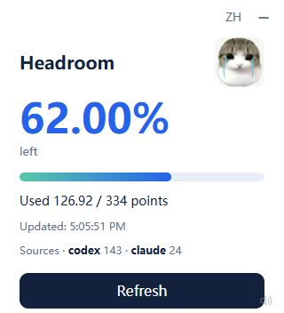

<div align="center">

# headroom

**I need a reset.**

Your AI has a usage limit. So do you.

**English** · [简体中文](README.zh-CN.md)

A local-first Codex plugin and skill that gives AI conversations a daily brain budget.<br>
Imaginary points, a tiny tray card, and a few very expressive animals.

[Quick start](#quick-start) · [Supported tools](#supported-tools) · [Scoring](#scoring) · [Privacy](#privacy) · [Docs](#docs--contributing)



</div>

## A usage limit for the human

- **One daily budget** across sessions and supported tools.
- **A small display**: Windows tray card, optional macOS menu bar, or web dashboard.
- **A little nonsense**: mood memes and clickable clips. Viewing, refreshing, and playback never spend points.
- **Local by default**, with English and Chinese interfaces.

| 100%–70% left | Below 70%–30% left | Below 30% left |
| :---: | :---: | :---: |
|  |  |  |
| One more prompt. | That was not a quick question. | I need a reset. |

For fun, not science: this is not a measurement of intelligence, health, or fatigue. Zero percent never blocks your conversations.

## Quick start

Requires **Python 3.10+** and readable local AI conversation history. Desktop displays also need Tk; the animated Windows card needs Edge WebView2 Runtime.

```sh
git clone https://github.com/llm-learner/headroom.git
cd headroom
```

### Windows

```powershell
python -m pip install -r skills/headroom/requirements-desktop.txt
pythonw skills/headroom/scripts/headroom_desktop.py --lang en --show
powershell -ExecutionPolicy Bypass -File skills/headroom/hooks/install_windows.ps1
```

The H icon opens the usage card; it may be under the taskbar's hidden-icons arrow. Click **EN / ZH** to switch languages.

If you already have `hooks.json`, the Windows installer stops to protect it. Follow the [setup guide](docs/guide.md#windows-hooks) to merge safely; do not force-overwrite it.

### macOS / Linux

```sh
sh skills/headroom/hooks/install.sh --link-skill
python3 skills/headroom/scripts/headroom_dashboard.py --lang en
```

Open [the web dashboard](http://127.0.0.1:8766/?lang=en). macOS also has an [optional menu bar display](docs/guide.md#macos-menu-bar).

**Enable automatic Codex scoring:** open `/hooks`, review and trust headroom's `SessionStart` and `UserPromptSubmit`, then start one new session. Keep the repository in place. Installing a plugin/skill alone does not enable hooks.

Want to try the meter without hooks? Run `python skills/headroom/scripts/headroom.py status`, or launch a display; it estimates usage from message counts.

## Supported tools

| Tool | Local history statistics | Automatic scoring via the bundled installer |
| --- | :---: | --- |
| Codex | ✓ | ✓ After trusting hooks |
| Claude Code | ✓ | Not configured automatically |
| opencode | ✓ | Not configured automatically |
| Antigravity | ✓ | Not configured automatically |
| WorkBuddy | ✓ | Not configured automatically |

Only readable histories on your machine contribute. Other tools use count-based estimates unless you configure their hooks separately. See [adapters and configuration](docs/reference.md#agent-adapters).

## How the budget works

Daily limit = **the busiest day in the previous seven complete days, pooled across supported tools, × 2**. The display shows today's **percent left**; days reset at **UTC+8**.

By default, each tool uses its scored debits when available; otherwise its usage is estimated as **today's messages × 2**. Hook scores range from 0–10. [Calculation details](docs/reference.md#budget-and-spend)

Automated-task filtering is best-effort, not a guarantee. [FAQ](docs/faq.md)

## Scoring

- **Mock** — included, default, deterministic pretend scores; no network.
- **Laya** — optional local model scoring; deploy the service separately. [Setup](docs/guide.md#local-laya-scoring)
- **Jev API** — not implemented. There are no Jev/cloud scoring calls in this release.

headroom is not an official Jev or Laya product.

## Privacy

- No headroom cloud account, telemetry, or cloud scoring in the shipped backends.
- History is parsed locally for counting; some adapters inspect message content to filter records. It is not uploaded or copied into the headroom ledger.
- Eligible current prompts are scored in memory by Mock or your local Laya service. The ledger and hook diagnostics do not store prompt text.

A separately deployed model service has its own logging and network behavior; these guarantees do not describe your AI tools' own data processing. [Data handling details](docs/reference.md#data-handling)

## Docs & contributing

[Setup and use](docs/guide.md) · [Configuration and internals](docs/reference.md) · [Troubleshooting](docs/faq.md) · [Contributing](CONTRIBUTING.md)

Code and documentation: [MIT](LICENSE). Third-party meme images, audio, and video are not covered by this license.
