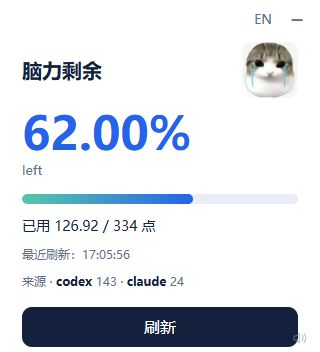

<div align="center">

# headroom

**I need a reset.**

AI 有使用额度，你的大脑也该有。

[English](README.md) · **简体中文**

一个本地优先的 Codex 插件 / Skill，给 AI 对话配个脑力日限额。<br>
虚构的点数、小小的托盘卡片，还有几只表情丰富的动物。

[快速开始](#快速开始) · [支持的工具](#支持的工具) · [评分](#评分) · [隐私](#隐私) · [文档](#文档与贡献)



</div>

## 给人类也配一个额度

- **共用一个日限额**：跨会话、跨支持的工具累计。
- **小小的显示入口**：Windows 托盘卡片、可选 macOS 菜单栏，或网页面板。
- **有点无厘头**：表情随额度变化，点击还能播放梗片段。查看、刷新和播放不扣点。
- **默认本地处理**，界面支持中英文切换。

| 剩余 100%–70% | 剩余低于 70% 至 30% | 剩余低于 30% |
| :---: | :---: | :---: |
|  |  |  |
| 再问最后一个问题。 | 这好像不是一个小问题。 | 这问题有问题啊！ |

纯属娱乐，不是科学测量：不代表智力、健康或疲劳程度。归零也不会阻止你聊天。

## 快速开始

需要 **Python 3.10+** 和本机可读取的 AI 对话历史。桌面显示还需要 Tk；Windows 动态卡片需要 Edge WebView2 Runtime。

```sh
git clone https://github.com/llm-learner/headroom.git
cd headroom
```

### Windows

```powershell
python -m pip install -r skills/headroom/requirements-desktop.txt
pythonw skills/headroom/scripts/headroom_desktop.py --lang zh --show
powershell -ExecutionPolicy Bypass -File skills/headroom/hooks/install_windows.ps1
```

点击 H 图标展开用量卡片；图标可能在任务栏的隐藏箭头里。点击 **EN / ZH** 即可切换语言。

如果已有 `hooks.json`，Windows 安装器会停止以保护原文件。请按[安装指南](docs/guide.zh-CN.md#windows-钩子)安全合并，不要强制覆盖。

### macOS / Linux

```sh
sh skills/headroom/hooks/install.sh --link-skill
python3 skills/headroom/scripts/headroom_dashboard.py --lang zh
```

打开[网页面板](http://127.0.0.1:8766/?lang=zh)。macOS 也有[可选菜单栏显示](docs/guide.zh-CN.md#macos-菜单栏)。

**开启 Codex 自动评分：**打开 `/hooks`，审查并信任 headroom 的 `SessionStart` 和 `UserPromptSubmit`，然后新建一次会话。请保留仓库目录；仅安装插件 / Skill 不会启用钩子。

只想先体验？运行 `python skills/headroom/scripts/headroom.py status` 或启动显示即可，无需钩子，按消息条数估算用量。

## 支持的工具

| 工具 | 本地历史统计 | 随附安装器的自动评分配置 |
| --- | :---: | --- |
| Codex | ✓ | ✓ 信任钩子后启用 |
| Claude Code | ✓ | 不会自动配置 |
| opencode | ✓ | 不会自动配置 |
| Antigravity | ✓ | 不会自动配置 |
| WorkBuddy | ✓ | 不会自动配置 |

只统计本机存在且可读取的历史。其他工具默认按条数估算用量，除非另行配置钩子。详见[适配器与配置](docs/reference.zh-CN.md#agent-适配器)。

## 额度怎么算

日限额 = **之前七个完整自然日里，所有支持工具合计消息数最多的一天 × 2**。界面显示今天的**剩余百分比**，每天按 **UTC+8** 划分和重置。

默认按工具分别判断：有评分扣点时用评分，否则按**今天消息数 × 2**估算。钩子评分范围为 0–10。[计算细节](docs/reference.zh-CN.md#额度与用量)

自动任务筛选是尽力而为，不保证完全识别。[常见问题](docs/faq.zh-CN.md)

## 评分

- **Mock**：默认自带，确定性的虚构评分，不联网。
- **Laya**：可选的本地模型评分，需要自行部署服务。[配置方法](docs/guide.zh-CN.md#本地-laya-评分)
- **Jev API**：尚未实现，当前版本没有 Jev / 云端评分调用。

headroom 不是 Jev 或 Laya 的官方产品。

## 隐私

- 自带后端不需要 headroom 云账号，不添加遥测或云端评分。
- 历史仅在本机解析用于计数；部分适配器会检查消息内容来筛选记录，不上传，也不复制进 headroom 账本。
- 当前符合条件的提示词在内存中交给 Mock 或本地 Laya 评分；账本和钩子诊断不保存提示词正文。

另行部署的模型服务有自己的日志和联网行为；上述说明不代表 AI 工具本身的数据处理方式。[数据处理细节](docs/reference.zh-CN.md#数据处理)

## 文档与贡献

[安装与使用](docs/guide.zh-CN.md) · [配置与实现](docs/reference.zh-CN.md) · [排障](docs/faq.zh-CN.md) · [参与贡献](CONTRIBUTING.md#参与贡献)

代码和文档采用 [MIT 许可证](LICENSE)。第三方梗图、音视频不在此授权范围内。
